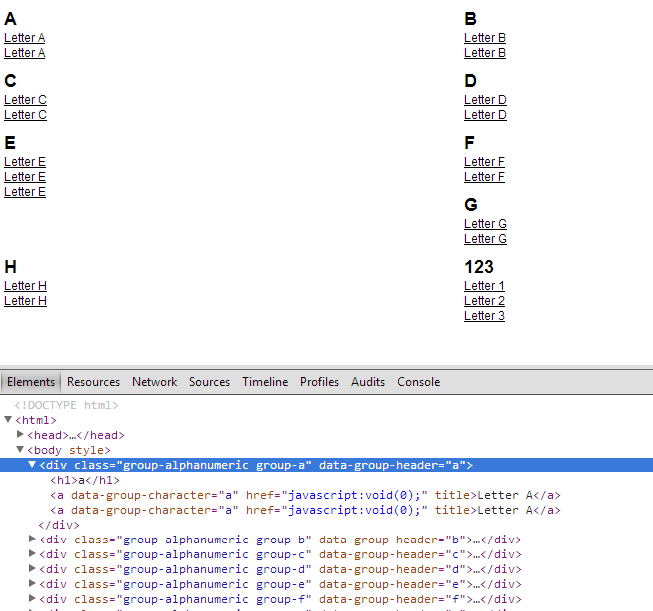

#jGroupAlphaNumeric

###This plugin purpose is to helps you group items into alpha numeric groups.

#####You have to specify for each element you want to group a data attribute named as default "group-character"
`<a data-group-character="a" href="javascript:void(0);" title="">Letter A</a>`

#####If you look into the source code you can see that you can change few of these options, for the plugin.

    {
        dataSelector: "group-character", // The default data attribute that is holding the group character
        wrapperTag: "div", // The default wrap tag
        addHeader: true, // Specify wherever you want to add a header to each group or not
        headerTag: "h1" // Specify the header tag
    }

#####To initialize the function you just called it like this

    $(document).ready(function(){
		$.groupAlphaNumeric();
	});

Also here you have a image preview after jGroupAlphaNumeric has been called.
